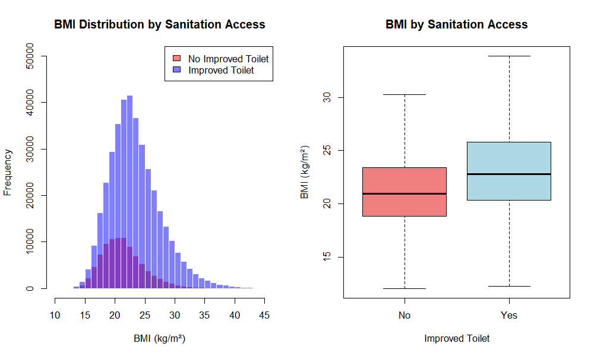
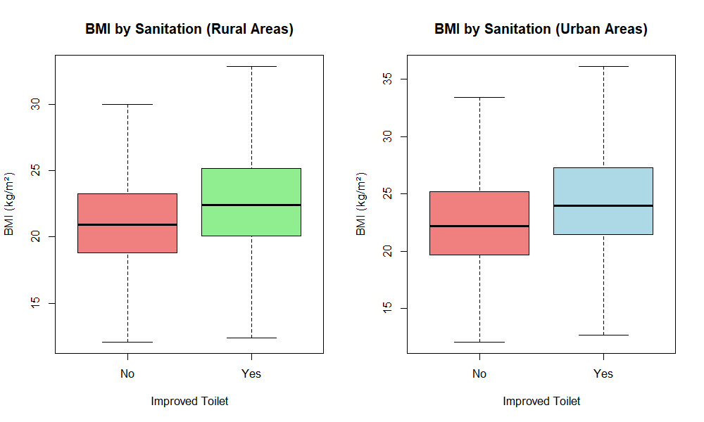
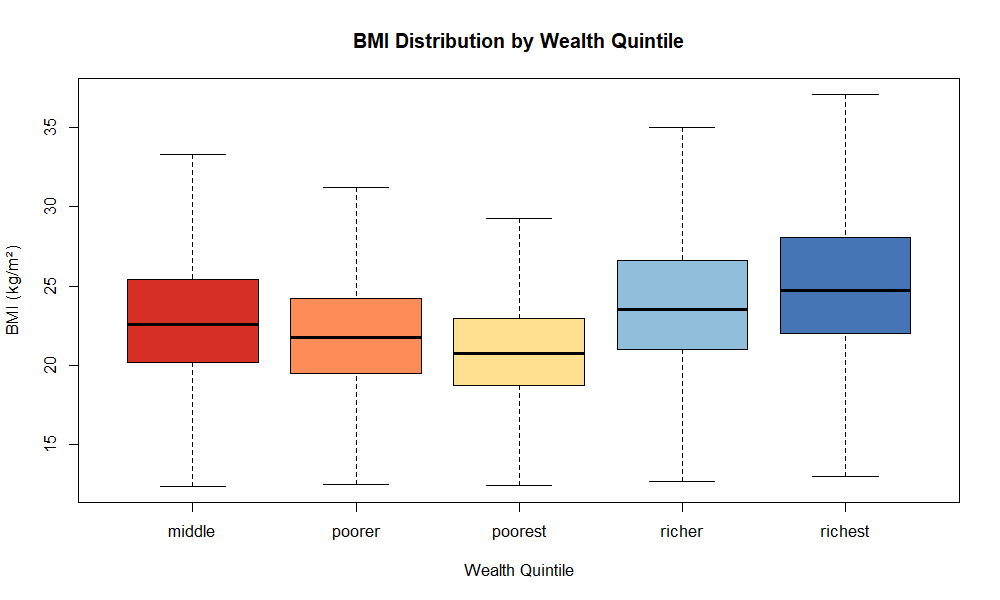
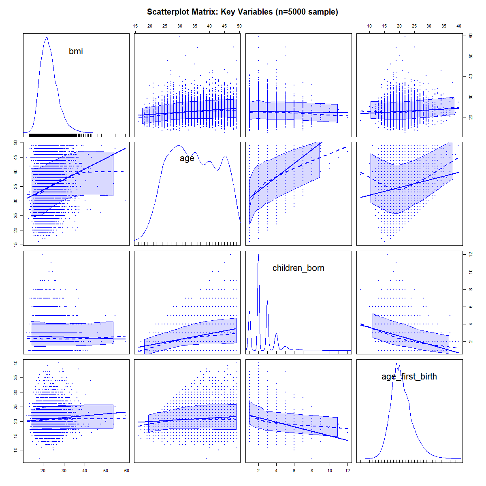
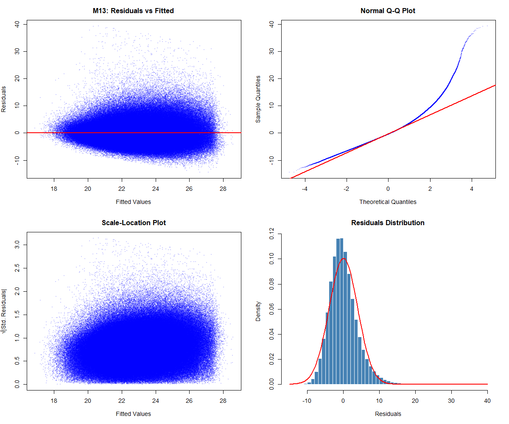
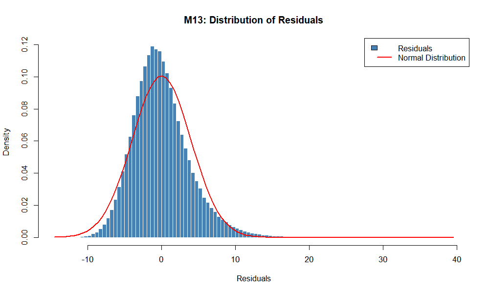
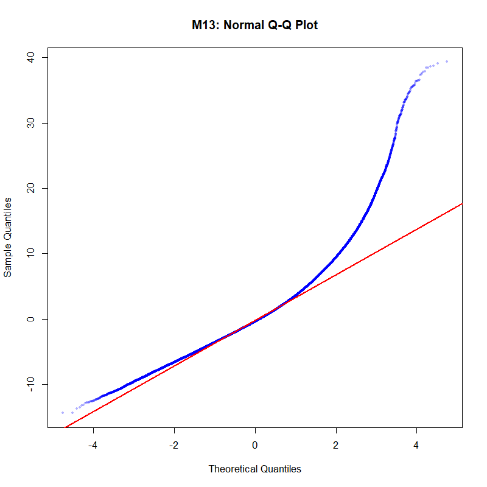
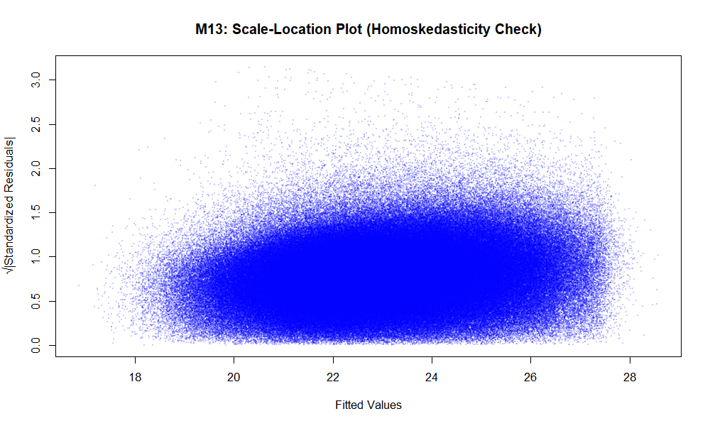

# Diagnostic Visualizations

This document displays all diagnostic and exploratory plots from the econometric analysis of the impact of improved sanitation on BMI in India.

---

## 1. Descriptive Analysis

### Plot 1: BMI Distribution by Sanitation Access

**Description:** This plot shows the distribution of BMI stratified by sanitation access. The histogram overlay demonstrates the difference in BMI distributions between women with and without access to improved toilets. The boxplot confirms that the mean BMI is higher among women with improved sanitation, which is the core finding of the M13 model.

**Key Observation:** Mean BMI is clearly higher in the improved toilet group (≈23-24 kg/m²) compared to the no toilet group (≈21-22 kg/m²).

---

### Plot 2: Urban-Rural Comparison of Sanitation Effects

**Description:** This comparative plot shows how the sanitation-BMI relationship differs between rural and urban areas. This is critical for understanding the main finding of the M13 model, which includes an interaction term between improved toilet access and urban status.

**Key Observation:** The sanitation effect appears more pronounced in rural areas, suggesting that the interaction term in M13 may capture differential effects across urban-rural divides.

---

### Plot 3: BMI Distribution by Wealth Quintile

**Description:** This boxplot demonstrates how BMI varies across wealth quintiles, from poorest to richest. Wealth is a key control variable in all models, as it may confound the sanitation-BMI relationship (wealthier individuals have both better sanitation and potentially different nutritional status).

**Key Observation:** BMI generally increases with wealth quintile, confirming wealth as an important control variable. The color gradient (red→blue) represents poverty→richness.

---

### Plot 4: Scatterplot Matrix of Key Variables

**Description:** This matrix of scatterplots shows the relationships between BMI and principal predictor variables (age, children born, age at first birth). Based on a random sample of 5,000 observations for computational efficiency. The plots include regression lines and smooth fits to reveal nonlinear patterns.

**Key Observation:** 
- BMI shows some variation with age (potentially nonlinear)
- Relationships with children born and age at first birth are relatively weak individually
- These patterns justify including these variables as controls

---

## 2. M13 Model Diagnostics

### Plot 5: Four-Panel Diagnostic Plot for M13

**Description:** This comprehensive diagnostic plot includes four standard regression diagnostics:
- **Top Left (Residuals vs Fitted):** Shows whether residuals have a mean of zero and constant variance
- **Top Right (Q-Q Plot):** Assesses normality of residuals
- **Bottom Left (Scale-Location):** Tests for heteroskedasticity (scale-location plot)
- **Bottom Right (Residuals Histogram):** Visual check on normality of residuals

**Interpretation:** 
- The residuals vs fitted plot shows some heteroskedasticity, justifying the use of cluster-robust standard errors (clustered at state level)
- The Q-Q plot shows some deviation from normality at the tails, which is expected with 480K observations
- The scale-location plot confirms heteroskedasticity issues
- The histogram suggests approximately normal distribution with slight right skew

---

### Plot 6: Distribution of M13 Residuals

**Description:** Detailed histogram of residuals overlaid with the theoretical normal distribution (red curve). This provides a more detailed view of residual distribution than the diagnostic plot.

**Interpretation:** The residuals are approximately normally distributed with a slight right skew. Given the large sample size (N=480K), minor deviations from normality do not substantially affect inference.

---

### Plot 7: Normal Q-Q Plot for M13 Residuals

**Description:** Quantile-quantile plot comparing the distribution of standardized residuals against theoretical normal quantiles. Deviations from the red reference line indicate departures from normality.

**Interpretation:** The plot shows reasonably good agreement with the normal distribution in the central region, with some deviation in the tails. This is typical and not problematic for large samples.

---

### Plot 8: Scale-Location Plot for M13

**Description:** This plot shows the square root of standardized residuals vs fitted values, used to detect heteroskedasticity. The red line shows the mean level of standardized residuals.

**Interpretation:** The plot reveals heteroskedasticity (non-constant variance across fitted values), particularly at higher fitted values. This heteroskedasticity is addressed by using cluster-robust standard errors in the M13 model estimates.

---

## Model Performance Summary

**M13 (Urban-Rural Heterogeneity Model)**
- **R² = 0.1776** (explains 17.76% of BMI variation)
- **F-statistic = 1,699.76** (p < 0.001)
- **Key Finding:** Improved sanitation increases BMI by **0.2622 kg/m²** (p < 0.001)
- **Sample Size:** 480,052 women across 28 Indian states

---

## Diagnostic Test Results

All diagnostic tests for the M13 model are detailed in the [M13_MODEL_DETAILED_ANALYSIS.md](M13_MODEL_DETAILED_ANALYSIS.md) document, including:

✓ **Breusch-Godfrey Test** (Serial Correlation): Test statistic = 195.24, p < 0.001
✓ **Durbin-Watson Test** (Autocorrelation): DW ≈ 1.82 (acceptable range)
✓ **RESET Test** (Model Specification): Significant at p < 0.05
✓ **Breusch-Pagan Test** (Heteroskedasticity): Significant (χ² = 10,255.48)
✓ **Multicollinearity Check**: Max adjusted GVIF = 3.73 (well below threshold of 10)
✓ **Normality Tests**: Slight deviation from normality expected with large N

---

## How to Interpret These Results

1. **Descriptive Plots (1-4):** Demonstrate that the raw data patterns align with model predictions
2. **Diagnostic Plots (5-8):** Validate model assumptions and highlight any issues:
   - Heteroskedasticity detected → addressed via cluster-robust SE
   - Near-normality → appropriate for large N
   - Slight specification issues → controlled through multiple robustness checks

3. **Connection to Econometric Analysis:** See [M13_MODEL_DETAILED_ANALYSIS.md](M13_MODEL_DETAILED_ANALYSIS.md) for full interpretation of diagnostic tests

---

**Generated:** R 4.4.1 with packages: ggplot2, car, gridExtra, sandwich
**Data:** NFHS-5 (2019-2021), 480,052 observations, India
